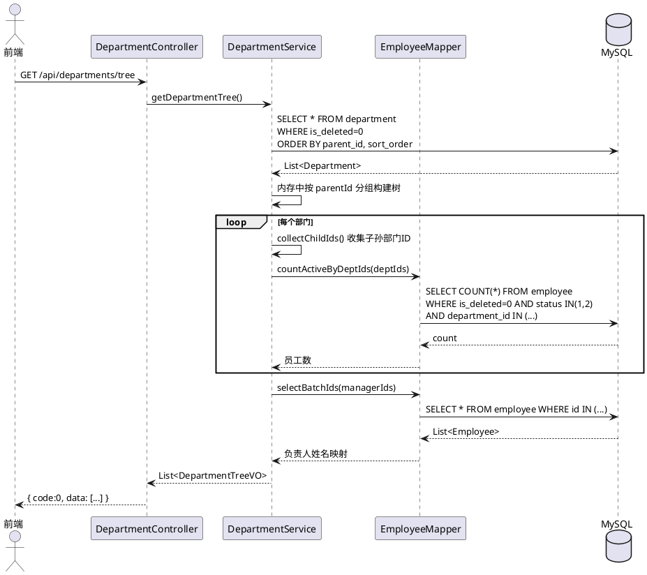
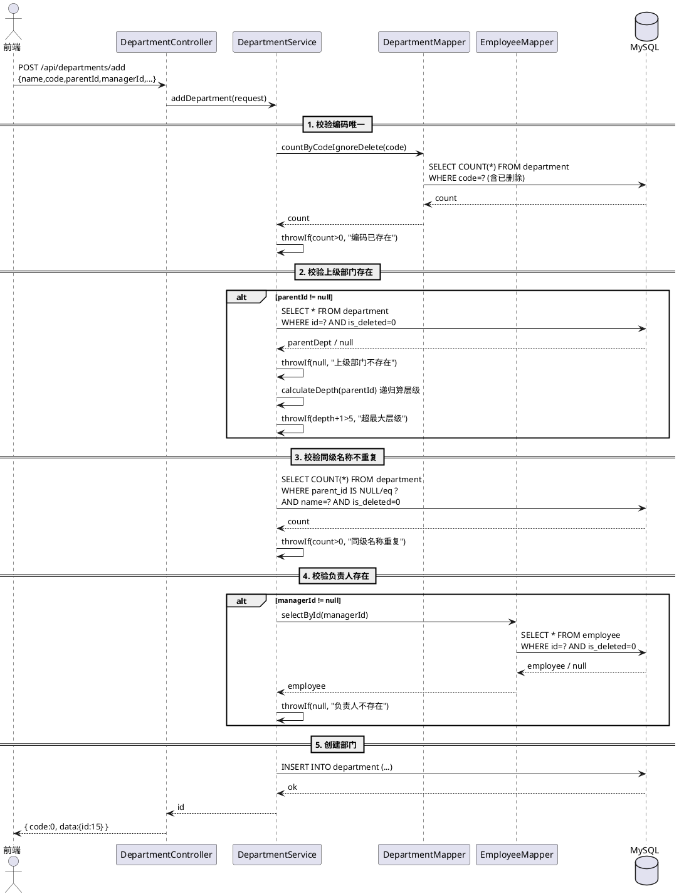
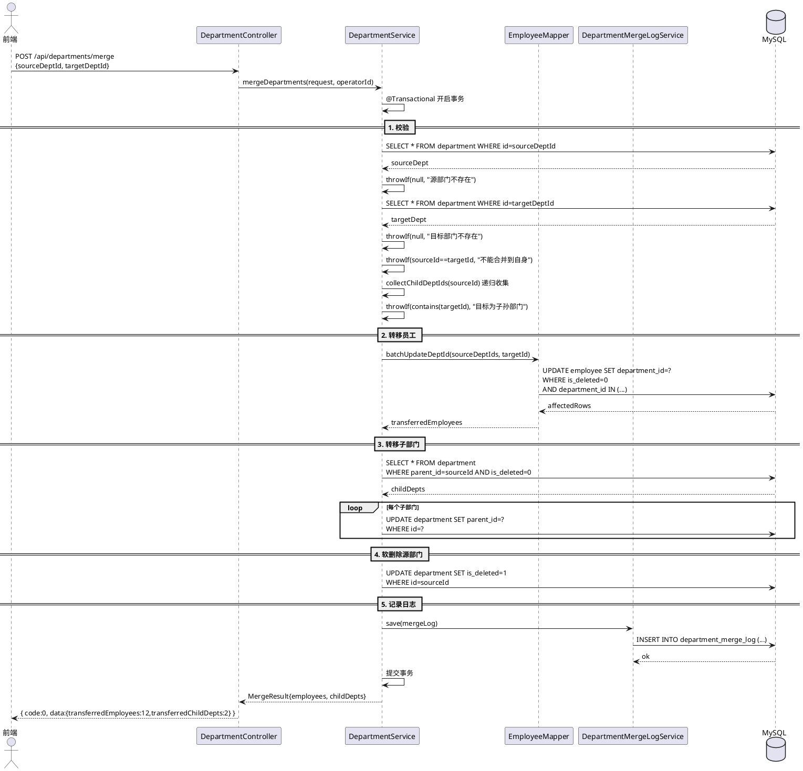
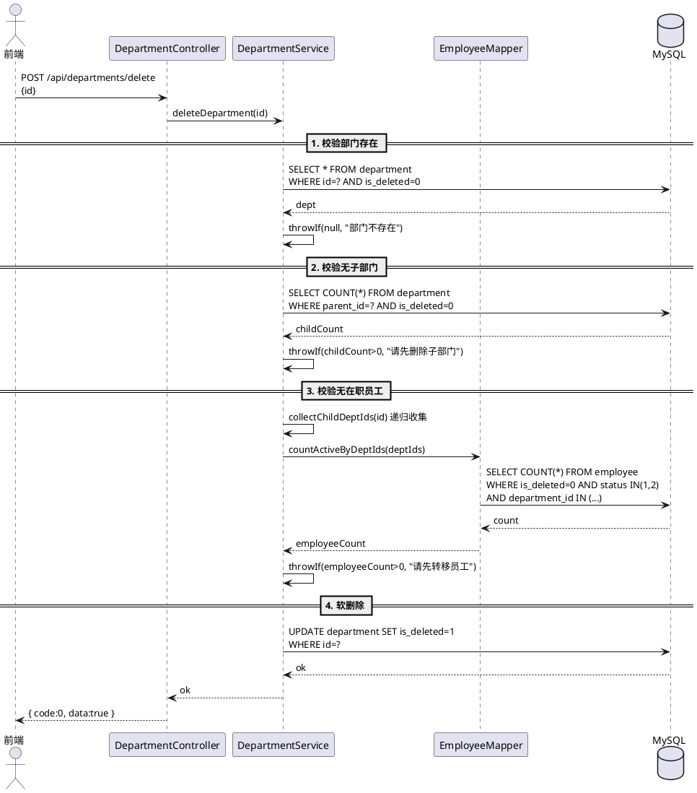
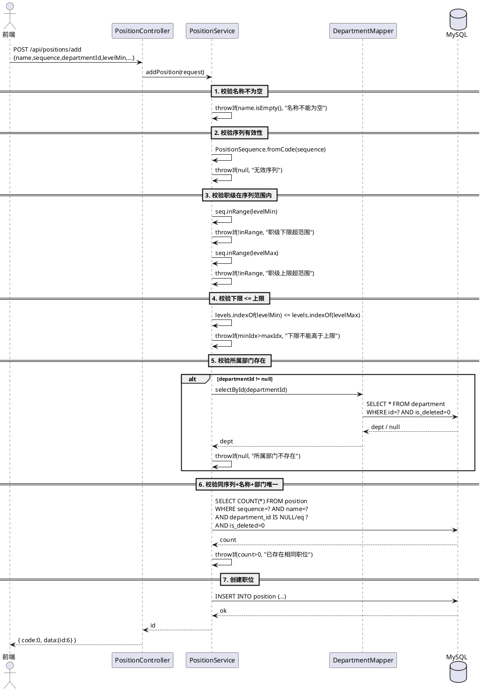
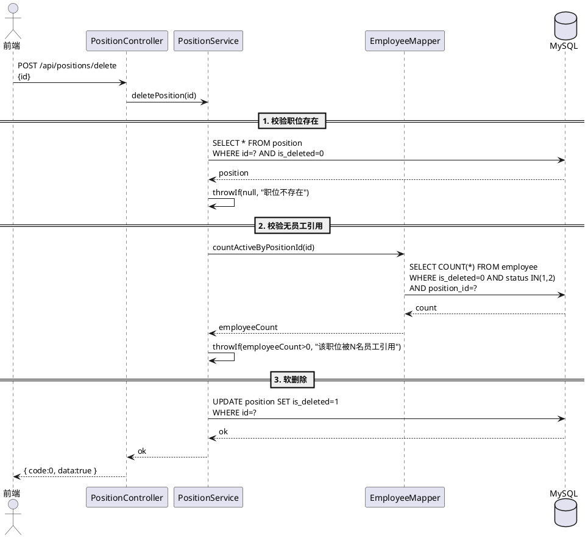

# HRMS-后端-组织架构管理

## 变更记录

> 记录每次修订的内容，方便追溯。

| **日期** | **版本** | **修订说明** | **作者** |
| --- | --- | --- | --- |
| 2026-07-10 | 1.0 | 初稿 | - |
| 2026-07-12 | 1.1 | 修订：API路径、校验规则、DB列名映射、技术栈、代码结构 | - |

## 项目背景

> 对本次项目的背景以及目标进行描述，方便开发者理解需求，对齐上下文。

本模块来源于 HRMS（人资管理系统）产品规格说明书中第 3 部分——组织架构管理。当前公司内部组织架构依赖线下维护，缺乏统一的部门树和职位体系管理。本模块旨在建立公司多级组织架构的数字化管理能力，涵盖部门增删改查与人员统计、职位序列与职级体系定义，为员工档案、入转调离、考勤薪资等模块提供组织和职位基础数据支撑。

### 相关资料

- [人资管理系统（HRMS）详细产品规格说明书](https://yuque.antfin.com/ww89nu/ng0ckr/tttxtqry8pfycc6s)
- 

### 参与人

| **项目负责人** | ... |
| --- | --- |
| **产品经理** | ... |
| **设计师** | ... |
| **工程师** | ... |

## 技术栈

| 层级 | 技术 |
|---|---|
| 框架 | Spring Boot 2.7.2 |
| ORM | MyBatis-Plus 3.5.2（逻辑删除：全局字段 `isDelete`） |
| 数据库 | MySQL 8.0（下划线命名，`map-underscore-to-camel-case: false`） |
| 缓存 | Redis（Lettuce 客户端） |
| 接口文档 | Knife4j（Swagger 仅保留 `@Api` + `@ApiOperation`，DTO/VO 无额外注解） |
| Java | JDK 11（编译目标） |

## 功能模块

> 描述组织架构管理涉及的功能与场景。

本模块核心功能包括：

1. **部门管理**：支持多级部门树增删改查，部门编码用于工号生成，部门负责人决定数据权限范围
2. **部门层级约束**：最大层级深度 5 级，部门合并时强制员工转移
3. **部门人数统计**：实时统计该部门及下属部门在职员工数（在职 + 试用期）
4. **职位管理**：定义职位名称、职位序列（M/P/S）、职级范围、默认试用期
5. **职位序列职级对照**：管理序列 M1-M5、专业序列 P1-P10、支持序列 S1-S5

### 功能模块树

```plain
组织架构管理
├── 部门管理
│   ├── 部门树查询
│   ├── 部门详情查询（单独查询单个部门）
│   ├── 部门新增
│   ├── 部门编辑
│   ├── 部门删除（校验：无下属部门 + 无在职员工）
│   ├── 部门合并（含员工批量转移 + 子部门转移）
│   └── 部门人数统计（含递归汇总）
└── 职位管理
    ├── 职位列表查询
    ├── 职位新增
    ├── 职位编辑
    ├── 职位删除（校验：无在职员工引用）
    └── 职位序列职级对照查询
```

## 数据库设计

> 组织架构管理模块涉及的核心数据表。所有表使用下划线列名（snake_case），
> Java 实体通过 `@TableField` 注解映射到驼峰字段名。

### 1. 部门表 department

```sql
#部门表----与employee进行关联
CREATE TABLE department (
    id              BIGINT          NOT NULL AUTO_INCREMENT  COMMENT '主键ID',
    deptName       VARCHAR(64)     NOT NULL                 COMMENT '部门名称',
    deptCode       VARCHAR(16)     NOT NULL                 COMMENT '部门编码（2位，用于工号生成）',
    parentId       BIGINT          DEFAULT NULL             COMMENT '上级部门ID，NULL表示根部门',
    managerId      BIGINT          DEFAULT NULL             COMMENT '部门负责人ID（关联员工表）',
    sortOrder      INT             NOT NULL DEFAULT 0       COMMENT '排序序号（越小越靠前）',
    description     VARCHAR(256)    DEFAULT NULL             COMMENT '部门描述',
    createdTime      DATETIME        NOT NULL DEFAULT CURRENT_TIMESTAMP COMMENT '创建时间',
    updatedTime      DATETIME        NOT NULL DEFAULT CURRENT_TIMESTAMP ON UPDATE CURRENT_TIMESTAMP COMMENT '更新时间',
    isDeleted               tinyint  default 0                 not null comment '逻辑删除：0=否 1=是',
    PRIMARY KEY (id),
    UNIQUE KEY uk_dept_code (deptCode),
    KEY idx_parent_id (parentId),
    KEY idx_manager_id (managerId)
) ENGINE=InnoDB DEFAULT CHARSET=utf8mb4 COMMENT='部门表';

```

**Java 实体映射（Department.java）**：

| DB 列名 | Java 字段 |
|---|---|
| `name` | `deptName` |
| `code` | `deptCode     |
| `parentId` | `parentId     |
| `managerId` | `managerId` |
| `sortOrder` | `sortOrder    |
| `isDeleted` | `isDeleted    |
| `createTime` | `createdTime` |
| `updateTime` | `updatedTime` |

---

### 2. 职位表 position

```sql
create table position
(
    id                   bigint unsigned auto_increment comment '主键ID'
    primary key,
    name                 varchar(64)             not null comment '职位名称，如Java开发工程师',
    sequence             tinyint                 not null comment '职位序列：1=M管理 2=P专业 3=S支持',
    departmentId         bigint unsigned         null comment '所属部门ID，空表示全公司通用',
    levelMin             varchar(8)              not null comment '职级下限，如P1',
    levelMax             varchar(8)              not null comment '职级上限，如P10',
    defaultProbationMonths int      default 3    not null comment '默认试用期月数',
    description          varchar(256)                       null comment '职位描述/岗位职责',
    isDeleted            tinyint  default 0                 not null comment '逻辑删除：0=否 1=是',
    createTime           datetime default CURRENT_TIMESTAMP not null comment '创建时间',
    updateTime           datetime default CURRENT_TIMESTAMP not null on update CURRENT_TIMESTAMP comment '更新时间'
)comment '职位表';

create index idx_department_id
    on position (departmentId);

create index idx_sequence
    on position (sequence);
```


---

### 3. 部门合并日志表 department_merge_log

```sql
CREATE TABLE IF NOT EXISTS `department_merge_log` (
    `id`                   BIGINT UNSIGNED   NOT NULL AUTO_INCREMENT COMMENT '主键ID',
    `sourceDeptId`       BIGINT UNSIGNED   NOT NULL COMMENT '源部门ID（被合并）',
    `sourceDeptName`     VARCHAR(64)       NOT NULL COMMENT '源部门名称（快照）',
    `targetDeptId`       BIGINT UNSIGNED   NOT NULL COMMENT '目标部门ID（保留）',
    `targetDeptName`     VARCHAR(64)       NOT NULL COMMENT '目标部门名称（快照）',
    `transferredEmployees` INT              NOT NULL DEFAULT 0 COMMENT '转移员工数',
    `operatorId`          BIGINT UNSIGNED   NOT NULL COMMENT '操作人ID',
    `createTime`          DATETIME          NOT NULL DEFAULT CURRENT_TIMESTAMP COMMENT '创建时间',
    PRIMARY KEY (`id`),
    KEY `idx_source_dept_id` (`sourceDeptI`),
    KEY `idx_target_dept_id` (`targetDeptId`),
    KEY `idx_create_time` (`createTime`)
) DEFAULT CHARACTER SET = utf8mb4 COMMENT = '部门合并日志表';
```

---

### 4. 员工表 employee

```sql
#employee表-----存放员工的所以信息
create table  if not exists employee
(
    id             bigint          auto_increment comment 'id' primary key,
    employeeName   varchar(128)    not null comment '员工名称（真实姓名）',
    userId         bigint          null comment '关联用户ID',
    employeeNo     VARCHAR(16)     NOT NULL COMMENT '工号, 格式: 年份(4)+部门编码(2)+序号(3)',
    status         tinyint         default 1                 not null comment '状态：0-离职，1-在职，2-试用期',
    gender         TINYINT         NOT NULL DEFAULT 0 COMMENT '性别: 0=女, 1=男',
    idCard         VARCHAR(256)    DEFAULT NULL COMMENT '身份证号（加密存储）',
    
    hireDate       datetime            null comment '入职日期',
    hireType       tinyint             null comment '入职类型',
    departmentId   bigint              null comment '部门ID',
    positionId     bigint              null comment '职位ID',
    employmentType     VARCHAR(16)     NOT NULL COMMENT '录用类型: FULL_TIME=全职, PART_TIME=兼职, INTERN=实习',
    email                   varchar(256)     null comment '邮箱',
    currentAddress          varchar(512)     null comment '现居住地址',
    emergencyContactName    varchar(128)     null comment '紧急联系人姓名',
    emergencyContactPhone   varchar(32)      null comment '紧急联系人电话',
    createTime     datetime     default CURRENT_TIMESTAMP not null comment '创建时间',
    updateTime     datetime     default CURRENT_TIMESTAMP not null on update CURRENT_TIMESTAMP comment '更新时间',
    isDeleted      tinyint      default 0    not null comment '是否删除'
) comment '员工' collate = utf8mb4_unicode_ci;
```

---

### 初始化数据

```sql
-- 默认根部门
INSERT IGNORE INTO `department` (`id`, `name`, `code`, `parent_id`, `sort_order`, `description`) VALUES
(1, '总公司', '00', NULL, 0, '公司根部门');

-- 默认职位
INSERT IGNORE INTO `position` (`id`, `name`, `sequence`, `department_id`, `level_min`, `level_max`, `default_probation_months`, `description`) VALUES
(1, '总经理',         1, NULL, 'M3', 'M5', 3, '公司总经理，管理序列'),
(2, '部门经理',       1, NULL, 'M1', 'M3', 3, '部门经理，管理序列'),
(3, '高级开发工程师', 2, NULL, 'P6', 'P8', 3, '高级开发，专业序列'),
(4, '开发工程师',     2, NULL, 'P3', 'P6', 3, '初中级开发，专业序列'),
(5, '行政专员',       3, NULL, 'S1', 'S3', 3, '行政支持，支持序列');
```

## API 设计

> 基础路径：`/api`（`server.servlet.context-path=/api`）
>
> 统一响应格式：`{ "code": 0, "data": ..., "message": "ok" }`
>
> 成功 `code=0`，参数错误 `code=400`，操作失败 `code=501`

---

### 1. 获取部门树

```
GET /api/departments/tree
```

**请求参数**：无

**响应格式**：

```json
{
  "code": 0,
  "message": "ok",
  "data": [
    {
      "id": 1,
      "name": "总公司",
      "code": "00",
      "parentId": null,
      "managerId": 100,
      "managerName": "王总",
      "sortOrder": 0,
      "description": "公司根部门",
      "employeeCount": 15,
      "children": [
        {
          "id": 10,
          "name": "技术部",
          "code": "01",
          "parentId": 1,
          "managerId": 200,
          "managerName": "李四",
          "sortOrder": 1,
          "description": null,
          "employeeCount": 42,
          "children": []
        }
      ]
    }
  ]
}
```

> `employeeCount` 为该部门及所有子部门在职员工数（status IN (1,2)）的递归汇总。
> 部门树一次性全量加载，内存中按 `parentId` 递归构建。

---

### 2. 查询单个部门详情

```
GET /api/departments/detail?id=7
```

**请求参数**（Query String）：

| **参数** | **类型** | **必填** | **描述** |
| --- | --- | --- | --- |
| id | Long | 是 | 部门ID |

**响应格式**：同部门树节点的 `data` 对象格式，`children` 为空数组。

> 适用于前端通过 URL 参数 `?deptId=7` 直接进入部门详情页的场景，无需加载整棵树。

---

### 3. 新增部门

```
POST /api/departments/add
Content-Type: application/json
```

**请求体**：

```json
{
  "name": "技术部",
  "code": "01",
  "parentId": 1,
  "managerId": 100,
  "sortOrder": 0,
  "description": "负责技术研发"
}
```

| **参数** | **类型** | **必填** | **描述** |
| --- | --- | --- | --- |
| name | String | 是 | 部门名称，最长32字符，不能为空 |
| code | String | 是 | 部门编码，2位，字母或数字 |
| parentId | Long | 否 | 上级部门ID，null=根部门 |
| managerId | Long | 否 | 部门负责人ID（employee.id），若填写必须真实存在 |
| sortOrder | Integer | 是 | 排序序号，越小越靠前 |
| description | String | 否 | 部门描述，最长128字符 |

**校验规则**：
- 编码不可与任何部门重复（含已软删除的，编码不可回收）
- 上级部门不存在或已删除时拒绝创建
- 层级深度（从根计数）不可超过 5 级
- 同级（同 parentId）部门名称不可重复
- 若填写 `managerId`，校验员工逻辑存在

**成功响应**：

```json
{ "code": 0, "message": "ok", "data": { "id": 15 } }
```

---

### 4. 更新部门

```
PUT /api/departments/update
Content-Type: application/json
```

**请求体**：

```json
{
  "id": 7,
  "name": "技术部",
  "managerId": 100,
  "sortOrder": 0,
  "description": "负责技术研发"
}
```

| **参数** | **类型** | **必填** | **描述** |
| --- | --- | --- | --- |
| id | Long | 是 | 部门ID（在请求体中） |
| name | String | 是 | 部门名称，不能为空 |
| managerId | Long | 否 | 部门负责人ID，若填写必须真实存在 |
| sortOrder | Integer | 是 | 排序序号 |
| description | String | 否 | 部门描述 |

> **说明**：部门编码和上级部门不支持直接修改。编码创建后锁定，上级部门变更需走合并流程。

**成功响应**：

```json
{ "code": 0, "message": "ok", "data": true }
```

---

### 5. 删除部门

```
POST /api/departments/delete
Content-Type: application/json
```

**请求体**：

```json
{ "id": 15 }
```

**校验规则**：
- 有子部门时拒绝删除（提示"请先删除子部门"）
- 该部门及子部门下有在职员工时拒绝删除（提示"请先转移员工至其他部门"）

> 逻辑删除（`is_deleted = 1`），编码保留不回收。

**成功响应**：

```json
{ "code": 0, "message": "ok", "data": true }
```

---

### 6. 合并部门

```
POST /api/departments/merge
Content-Type: application/json
```

**请求体**：

```json
{
  "sourceDeptId": 10,
  "targetDeptId": 20
}
```

| **参数** | **类型** | **必填** | **描述** |
| --- | --- | --- | --- |
| sourceDeptId | Long | 是 | 源部门ID（被合并） |
| targetDeptId | Long | 是 | 目标部门ID（保留） |

**校验规则**：
- 源部门 ≠ 目标部门（不能合并到自身）
- 目标部门不能是源部门的子部门

**事务操作**（`@Transactional`）：
1. 批量更新源部门及子部门所有员工的 `departmentId` → 目标部门
2. 批量更新源部门直属子部门的 `parentId` → 目标部门
3. 软删除源部门
4. 写入 `department_merge_log`

**成功响应**：

```json
{
  "code": 0,
  "message": "ok",
  "data": {
    "transferredEmployees": 12,
    "transferredChildDepts": 2
  }
}
```

---

### 7. 获取职位列表

```
GET /api/positions/list?sequence=2&departmentId=10
```

**请求参数**（Query String）：

| **参数** | **类型** | **必填** | **描述** |
| --- | --- | --- | --- |
| sequence | Integer | 否 | 职位序列过滤：1=M管理 2=P专业 3=S支持 |
| departmentId | Long | 否 | 部门ID过滤，不传返回所有 |

**响应格式**：

```json
{
  "code": 0,
  "message": "ok",
  "data": [
    {
      "id": 3,
      "name": "高级开发工程师",
      "sequence": 2,
      "sequenceName": "专业序列",
      "departmentId": null,
      "departmentName": "全公司通用",
      "levelMin": "P6",
      "levelMax": "P8",
      "levelRange": "P6-P8",
      "defaultProbationMonths": 3,
      "description": "高级开发，专业序列",
      "createTime": "2026-07-10T15:40:00"
    }
  ]
}
```

---

### 8. 新增职位

```
POST /api/positions/add
Content-Type: application/json
```

**请求体**：

```json
{
  "name": "Java开发工程师",
  "sequence": 2,
  "departmentId": 7,
  "levelMin": "P3",
  "levelMax": "P6",
  "defaultProbationMonths": 3,
  "description": "负责后端服务开发"
}
```

| **参数** | **类型** | **必填** | **描述** |
| --- | --- | --- | --- |
| name | String | 是 | 职位名称，最长32字符，不能为空 |
| sequence | Integer | 是 | 职位序列：1=M管理 2=P专业 3=S支持 |
| departmentId | Long | 否 | 所属部门ID，null=全公司通用，若填写必须真实存在 |
| levelMin | String | 是 | 职级下限，必须在对应序列范围内 |
| levelMax | String | 是 | 职级上限，必须在对应序列范围内，且 >= levelMin |
| defaultProbationMonths | Integer | 是 | 默认试用期月数，1-12 |
| description | String | 否 | 职位描述，最长256字符 |

**校验规则**：
- 职级范围必须在对应序列允许范围内（如 P序列仅 P1-P10）
- levelMin 不能高于 levelMax
- 同序列 + 同名称 + 同部门（含null）不可重复
- 若填写 `departmentId`，校验部门逻辑存在且未删除

**成功响应**：

```json
{ "code": 0, "message": "ok", "data": { "id": 6 } }
```

---

### 9. 更新职位

```
PUT /api/positions/update
Content-Type: application/json
```

**请求体**：

```json
{
  "id": 3,
  "name": "高级Java开发工程师",
  "sequence": 2,
  "departmentId": 7,
  "levelMin": "P6",
  "levelMax": "P8",
  "defaultProbationMonths": 6,
  "description": "负责后端服务架构设计"
}
```

> 参数与新增一致，额外需传 `id`（职位ID，在请求体中）。

**成功响应**：

```json
{ "code": 0, "message": "ok", "data": true }
```

---

### 10. 删除职位

```
POST /api/positions/delete
Content-Type: application/json
```

**请求体**：

```json
{ "id": 6 }
```

**校验规则**：
- 有在职员工（status IN (1,2)）引用该职位时拒绝删除

**成功响应**：

```json
{ "code": 0, "message": "ok", "data": true }
```

---

### 11. 获取序列职级对照

```
GET /api/positions/sequences
```

**响应格式**：

```json
{
  "code": 0,
  "message": "ok",
  "data": [
    {
      "sequence": 1,
      "sequenceName": "管理序列",
      "sequenceCode": "M",
      "levels": ["M1", "M2", "M3", "M4", "M5"]
    },
    {
      "sequence": 2,
      "sequenceName": "专业序列",
      "sequenceCode": "P",
      "levels": ["P1", "P2", "P3", "P4", "P5", "P6", "P7", "P8", "P9", "P10"]
    },
    {
      "sequence": 3,
      "sequenceName": "支持序列",
      "sequenceCode": "S",
      "levels": ["S1", "S2", "S3", "S4", "S5"]
    }
  ]
}
```

> 前端选择序列后，职级下拉从对应 `levels` 获取可选项，用于职位表单的级联选择。

---

## API 汇总

| # | 方法 | 路径 | 说明 |
|---|---|---|---|
| 1 | GET | `/api/departments/tree` | 获取部门树（全量，含递归人数） |
| 2 | GET | `/api/departments/detail` | 查询单个部门详情 |
| 3 | POST | `/api/departments/add` | 新增部门 |
| 4 | PUT | `/api/departments/update` | 更新部门（id在请求体） |
| 5 | POST | `/api/departments/delete` | 删除部门（id在请求体） |
| 6 | POST | `/api/departments/merge` | 合并部门 |
| 7 | GET | `/api/positions/list` | 获取职位列表 |
| 8 | POST | `/api/positions/add` | 新增职位 |
| 9 | PUT | `/api/positions/update` | 更新职位（id在请求体） |
| 10 | POST | `/api/positions/delete` | 删除职位（id在请求体） |
| 11 | GET | `/api/positions/sequences` | 获取序列职级对照 |

## 时序图

> 以下时序图使用 PlantUML 绘制，可在 [PlantUML 在线编辑器](https://www.plantuml.com/plantuml) 中渲染。

### 部门树查询



### 部门新增（含校验）



### 部门合并（事务）



### 部门删除（含校验）



### 职位新增（含校验）



### 职位删除（含校验）



## 关键技术设计

### 部门树查询方案

1. `SELECT * FROM department WHERE isDeleted = 0 ORDER BY parentId, sortOrder`（MyBatis-Plus 自动追加 `isDeleted=0`）
2. 内存中按 `parentId` 分组，递归构建树
3. 部门人数：收集部门+所有子孙部门ID → `SELECT COUNT(*) FROM employee WHERE isDeleted = 0 AND status IN (1, 2) AND departmentId IN (...)`
4. 负责人姓名：收集所有 `managerId` → 批量查 `employee` 表获取 `name`
5. 孤儿子部门（parent 已删）：自动归入根层级，打印日志

### 部门层级深度校验

- `calculateDepth(deptId)` 从目标父部门逐级递归向上计数
- 若 `depth + 1 > MAX_DEPT_DEPTH(5)`，拒绝创建
- 未使用 `path` 字段优化（当前部门数量级不需要）

### 部门合并事务保障

`@Transactional(rollbackFor = Exception.class)` 包裹：

1. 批量更新员工 `departmentId` → 目标部门（`EmployeeMapper.batchUpdateDeptId`）
2. 批量更新直属子部门 `parentId` → 目标部门
3. 软删除源部门
4. 写入 `department_merge_log`

### 部门编码唯一性

- `department.code` 有 `UNIQUE KEY uk_code`
- 新增时通过 `countByCodeIgnoreDelete` 绕过 `@TableLogic` 校验全部记录（含已删除），确保编码永不重复
- 编码创建后不可修改（update 接口不含 code 字段）

### 业务校验清单

| 校验项 | 位置 | 规则 |
|---|---|---|
| 部门名称不为空 | add/update | `name.isEmpty()` 拒绝 |
| 部门编码含已删除不可重复 | add | `countByCodeIgnoreDelete` |
| 上级部门逻辑存在 | add | `getById(parentId)` |
| 层级深度 ≤ 5 | add | `calculateDepth` 递归 |
| 同级名称不重复 | add/update | `isNull` / `eq` 分别处理 null |
| 负责人逻辑存在 | add/update | `selectById(managerId)` |
| 子部门为空 | delete | `count where parent_id = ?` |
| 无在职员工 | delete | `countActiveByDeptIds` 递归汇总 |
| 源部门 ≠ 目标部门 | merge | 直接比较 |
| 目标不是源子孙 | merge | `collectChildDeptIds` |
| 职位名称不为空 | add/update | `name.isEmpty()` 拒绝 |
| 所属部门逻辑存在 | add/update | `selectById(departmentId)` |
| 同序列+名称+部门唯一 | add/update | `isNull` / `eq` 分别处理 |
| 职级在序列范围内 | add/update | `PositionSequence.inRange()` |
| levelMin ≤ levelMax | add/update | indexOf 比较 |
| 无员工引用 | delete | `countActiveByPositionId` |

## 代码结构

```
src/main/java/com/limou/hrms/
├── controller/
│   ├── DepartmentController.java   # 部门管理（6个端点）
│   └── PositionController.java     # 职位管理（5个端点）
├── service/
│   ├── DepartmentService.java
│   ├── PositionService.java
│   ├── DepartmentMergeLogService.java
│   └── impl/
│       ├── DepartmentServiceImpl.java
│       ├── PositionServiceImpl.java
│       └── DepartmentMergeLogServiceImpl.java
├── mapper/
│   ├── DepartmentMapper.java       # 含 countByCodeIgnoreDelete（绕过@TableLogic）
│   ├── PositionMapper.java
│   ├── DepartmentMergeLogMapper.java
│   └── EmployeeMapper.java         # 含 countActiveByDeptIds、batchUpdateDeptId 原生SQL
├── model/
│   ├── entity/                     # Department, Position, DepartmentMergeLog, Employee
│   ├── dto/department/             # DepartmentAdd/Update/MergeRequest
│   ├── dto/position/               # PositionAdd/Update/QueryRequest
│   └── vo/                         # DepartmentTreeVO, DepartmentMergeResultVO, PositionVO, SequenceLevelVO
├── constant/
│   └── OrgConstant.java            # 序列枚举、最大层级、员工状态常量
└── sql/
    └── org_structure.sql           # 建表 + 初始化数据
```

## 排期

> 对研发时间计划进行排期。

| **阶段** | **内容** | **预估工期** |
| --- | --- | --- |
| 需求评审 | 评审产品规格，确认部门层级限制与职位序列定义 | 0.5天 |
| 技术方案 | 完成系分文档评审，确认数据库设计与接口方案 | 1天 |
| 数据库开发 | 建表、索引优化、初始化默认部门/职位数据脚本 | 0.5天 |
| 后端开发 | 部门CRUD、部门树查询、部门合并、人数统计、职位CRUD、序列对照 | 3天 |
| 前端开发 | 部门树管理页、职位管理页 | 2天 |
| 联调测试 | 前后端联调、合并场景测试、并发安全测试 | 1.5天 |
| 回归上线 | 全量回归、预发验证、正式上线 | 1天 |

> **总预估工期**：约 9.5 个工作日
